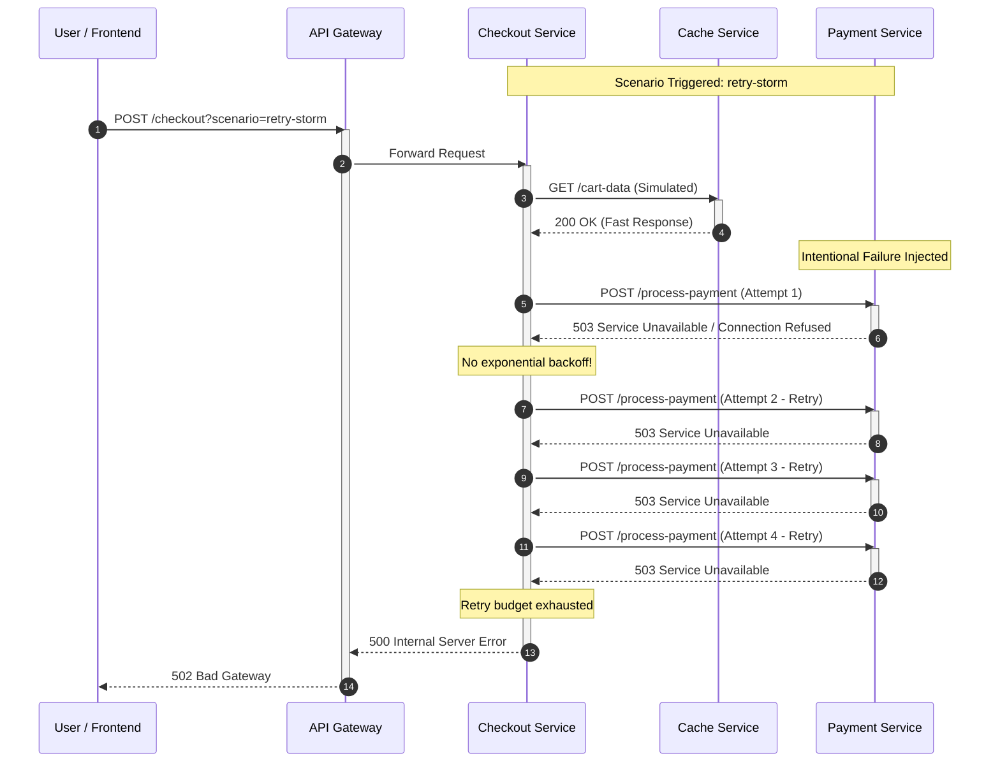
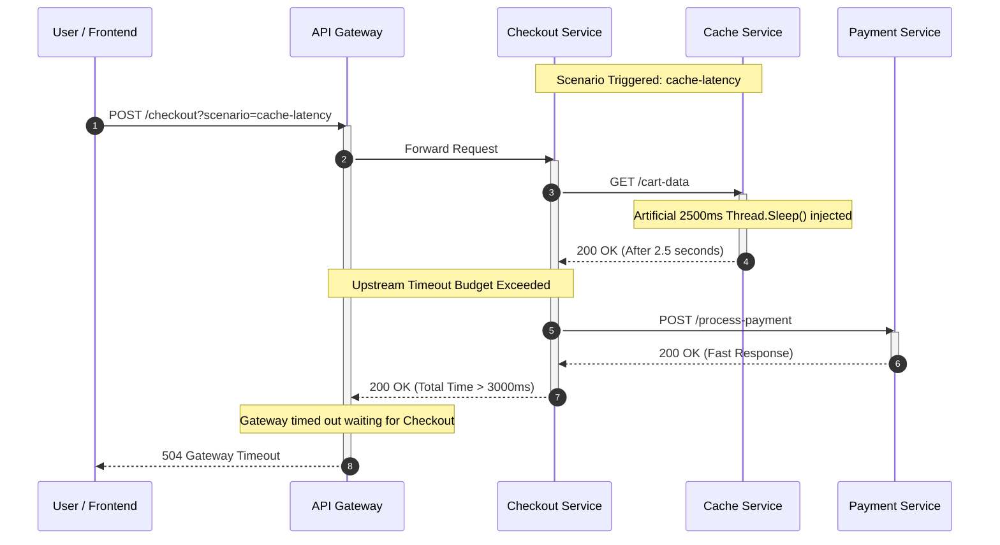

# TimeWeave AI

> **Replay. Reconstruct. Reason.**  
> *Time-travel observability for distributed systems.*

TimeWeave AI reconstructs distributed-system failures into replayable timelines using OpenTelemetry, Redis Streams, AI reasoning, and causal analysis. Instead of sifting through massive log files or disconnected trace IDs, developers get a cinematic, interactive dashboard that visualizes exactly how a failure cascaded across microservices in real-time.

---

## 🚀 Core Features

1. **Topology Replay (React Flow & SignalR):** Automatically builds an animated, pulsing dependency graph by listening to raw OpenTelemetry trace spans streamed via WebSockets.
2. **AI Incident Commander (Gemini 2.5 Pro):** Ingests raw distributed trace JSON and performs a causal root-cause analysis, explaining exactly what failed and why.
3. **Counterfactual Simulation:** Simulates the mathematical impact of applying Site Reliability Engineering (SRE) best practices (like circuit breakers, capped retries, and asynchronous queues) against the exact trace history of a recent outage.

---

## 🧠 How the Gemini API is Integrated

TimeWeave AI utilizes **Gemini 2.5 Pro** as an automated Site Reliability Engineer. Instead of forcing a human developer to deduce root causes, the `.NET Core` backend performs prompt engineering on raw telemetry.

**1. Data Ingestion:** 
The backend gathers all OpenTelemetry trace spans recorded during an incident session and formats them into a chronological timeline:
```text
Scenario: retry-storm
Incident Spans:
- Service: api-gateway, Operation: GET /checkout, Status: ERROR, Duration: 3500ms, Error: 502 Bad Gateway
- Service: checkout-service, Operation: GET /cart-data, Status: OK, Duration: 45ms
- Service: payment-service, Operation: POST /process-payment, Status: ERROR, Duration: 2100ms, Error: Connection Refused
...
```

**2. The Prompt Formulation:**
The formatted traces are injected into a strict system prompt and sent to `gemini-2.5-flash`:
> *"You are an expert Reliability Engineer and Incident Commander. Analyze the following distributed system trace timeline and telemetry. Determine the root cause, explain how the failure propagated, and write a human-readable incident narration and causal summary... [Trace Data Inserted] Provide output in specific Markdown headers."*

**3. AI Deduction:**
Gemini logically deduces causal relationships. For example, it identifies that while the Cache Service responded normally, the Checkout Service aggressively retried the failing Payment Service, accurately diagnosing a "Retry Storm" and generating a comprehensive Markdown incident report.

---

## 🏗 Architecture Deep Dive

TimeWeave AI is built as a **Modular Monolith (.NET Core)** backed by Node.js microservices to simulate a complex distributed architecture.

### The Realtime Telemetry Pipeline
1. **Mock Microservices (Node.js):** Services like `api-gateway`, `checkout-service`, and `payment-service` simulate real business logic and intentional chaotic failures (e.g., connection refusals, thread sleeps). 
2. **OpenTelemetry Collector:** As the microservices crash or process requests, they emit OpenTelemetry trace spans directly to our backend collector endpoint.
3. **Redis Streams (High-Throughput Buffer):** The backend immediately dumps these spans into a Redis Stream (`telemetry:stream`). This decoupled buffer ensures that massive telemetry spikes (like retry storms) do not overwhelm the UI.
4. **.NET Worker & WebSockets (SignalR):** A background worker (`RedisStreamService.cs`) consumes the Redis stream and pushes the spans asynchronously to the React frontend over persistent WebSockets (SignalR).
5. **Next.js React Flow UI:** The frontend plots the active spans on a topology graph, calculating dynamic status markers (Error, Latency, OK) and animating edge connections based on milliseconds-level timestamps.

---

## 📊 Scenario Technical Diagrams

These sequence diagrams illustrate the exact flow of network traffic and failures during our two primary mock scenarios.

### Scenario 1: Retry Storm
A single connection failure in the Payment Service cascades into a self-inflicted denial-of-service attack due to uncapped retries from the Checkout Service.



### Scenario 2: Cache Latency Spike
An artificial 2.5-second delay in the Cache Service consumes the overall transaction timeout budget, causing the Gateway to sever the connection before the Payment Service can complete.



---

## ⚙️ How to Run Locally

### Prerequisites
* Docker Desktop
* Node.js v20+

### 1. Setup Environment
Rename the `.env.example` file to `.env` in the root directory.
```bash
cp .env.example .env
```
Provide your actual Gemini API Key inside `.env`:
```env
GEMINI_API_KEY=your_real_api_key_here
```

### 2. Start the Backend Infrastructure
Launch the PostgreSQL database, Redis, the .NET Core backend, and all the mock Node microservices:
```bash
docker compose up -d --build
```

### 3. Start the Next.js Frontend
In a new terminal window, navigate to the `frontend` directory:
```bash
cd frontend
npm install
npm run dev
```

Navigate to `http://localhost:3000` to interact with TimeWeave AI. Click one of the **"Trigger: Scenario"** buttons to inject chaos and watch the graph map the telemetry in realtime!